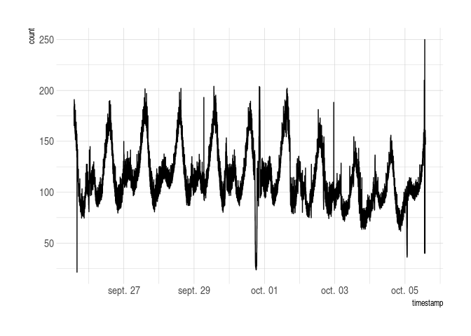
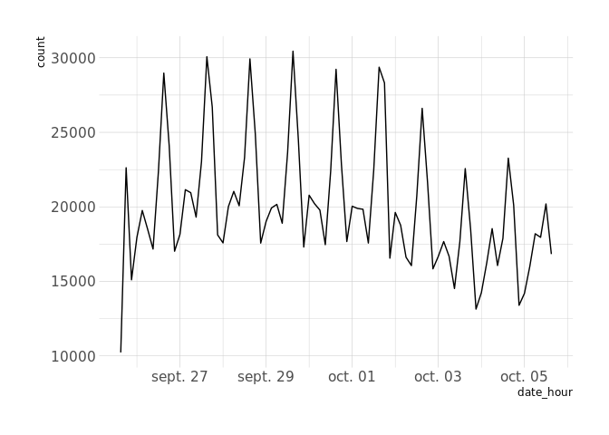
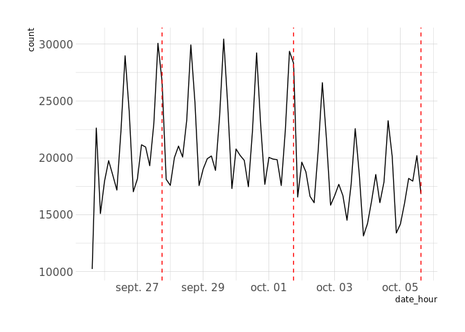

<!-- README.md is generated from README.Rmd. Please edit that file -->

# warp10r

<!-- badges: start -->

[](https://www.tidyverse.org/lifecycle/#experimental)
<!-- badges: end -->

R client for executing WarpScript on a Warp 10 instance.

## Fork

The original package \[<https://github.com/senx/warp10-r>\] has been
forked to make the package more concilient with current developments of
R packages :

  - Package has been moved to the root of the git repository
  - Dependancies have been added to the DESCRIPTION
  - Construct a warp 10 script with helpers function and send them to
    Warp 10 database

## Installation

``` r
remotes::install_github("centreon/warp10-r")
```

## First steps

### Hello World

``` r
library(warp10r)

# Create a connection
con <- wrp_connect(endpoint = "https://warp.senx.io/api/v0/exec")

# set_script store a script in the connection object and print the script as it is.
set_script(con, "'Hello World'")
#> 1 elements in the stack : map
set_script(con, "NOW")
#> 2 elements in the stack : map, map
cat("\n", get_script(con))
#> 
#>   'Hello World' 
#>  NOW

# Execute the script
wrp_exec(con)
#> [[1]]
#> [1] 1.572865e+15
#> 
#> [[2]]
#> [1] "Hello World"
```

### Example with Geo Time Series

``` r
library(tibble)

df1 <- tibble(ds = 1:10, y = rnorm(10))
df2 <- tibble(ds = 2:11, y = rnorm(10))

con %>% 
  clear_script() %>% 
  wrp_new_gts() %>% 
  wrp_rename("randGTS") %>% 
  wrp_add_value_df(df1, tick = ds, value = y) %>% 
  wrp_new_gts() %>% 
  wrp_add_value_df(df2, tick = ds, value = y) %>% 
  wrp_rename("nogeoTS") %>% 
  wrp_exec()
#> [[1]]
#> # A GTS object: 10 x 2
#> # class:        nogeoTS
#>    timestamp   value
#>  *     <dbl>   <dbl>
#>  1         2  0.793 
#>  2         3 -0.695 
#>  3         4 -0.228 
#>  4         5  0.0720
#>  5         6 -0.634 
#>  6         7  0.217 
#>  7         8 -0.0588
#>  8         9  0.181 
#>  9        10  0.509 
#> 10        11  1.28  
#> 
#> [[2]]
#> # A GTS object: 10 x 2
#> # class:        randGTS
#>    timestamp   value
#>  *     <dbl>   <dbl>
#>  1         1  1.000 
#>  2         2  1.62  
#>  3         3 -0.903 
#>  4         4  1.54  
#>  5         5 -1.06  
#>  6         6  0.714 
#>  7         7 -0.0429
#>  8         8 -0.913 
#>  9         9  0.0384
#> 10        10 -0.294
```

## Outlier detection

Anomaly detection is already implemented in Warpscript. Let’s take
twitter data as an example.

### Set up and show data

``` r
library(AnomalyDetection)
library(dplyr)
#> 
#> Attaching package: 'dplyr'
#> The following objects are masked from 'package:stats':
#> 
#>     filter, lag
#> The following objects are masked from 'package:base':
#> 
#>     intersect, setdiff, setequal, union
library(ggplot2)
library(hrbrthemes)
#> NOTE: Either Arial Narrow or Roboto Condensed fonts are required to use these themes.
#>       Please use hrbrthemes::import_roboto_condensed() to install Roboto Condensed and
#>       if Arial Narrow is not on your system, please see http://bit.ly/arialnarrow
library(lubridate)
#> 
#> Attaching package: 'lubridate'
#> The following object is masked from 'package:base':
#> 
#>     date
library(purrr)

data("raw_data")

raw_data %>% 
  ggplot(aes(timestamp, count)) + 
  geom_line() +
  theme_ipsum()
```



### Create a subset of the data

Default settings do not authorize more than 1,000 operations for a
warpscript. Therefore, let’s take the previous data and concatenate them
into 3 hours timespan.

``` r
df <- raw_data %>% 
  group_by(date_hour = ceiling_date(timestamp, "3 hours")) %>% 
  summarise_at("count", sum)

df %>% 
  ggplot(aes(date_hour, count)) +
  geom_line() +
  theme_ipsum()
```



### Lets find some anomalies

``` r
res <- con %>% 
  wrp_new_gts() %>% 
  wrp_rename("twitter data") %>% 
  wrp_add_value_df(df, tick = "date_hour", value = "count") %>% 
  wrp_bucketize(span = "3 h", bucketizer = "sum") %>% 
  wrp_hybridtest(period = 8, piece = 4, k = 4) %>% 
  wrp_exec()

# Results is a list of abnormal dates in microseconds
res_dbl <- map_dbl(res[[1]], ~ .x / 1e6)

df %>% 
  ggplot(aes(date_hour, count)) +
  geom_line() +
  geom_vline(xintercept = res_dbl, linetype = 2, color = "red") +
  theme_ipsum()
```


